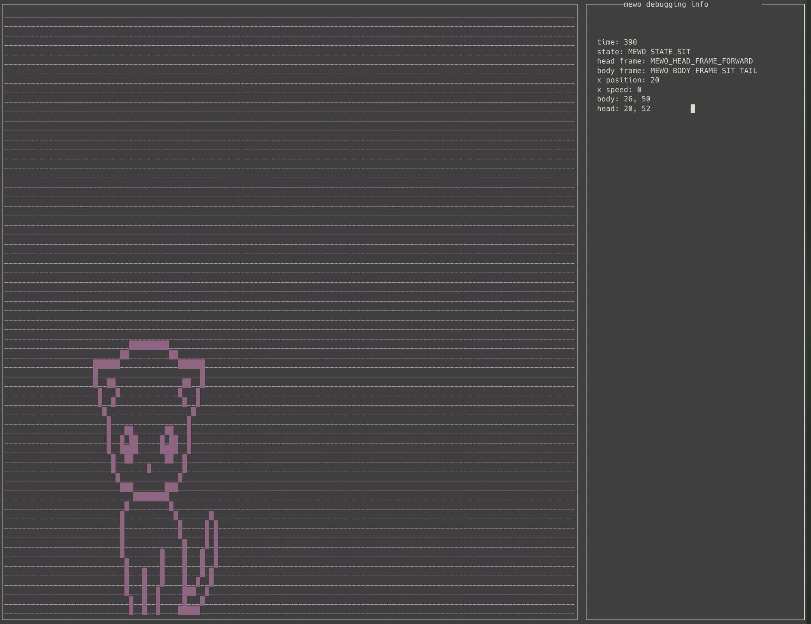

# Intro 
libmewo is a silly cat simulator. The cat (mewo) sits, walks around, and naps.

There are two ncurses executables
- `frame_validation` validates the individual combinations of mewo's body parts
- `anim_validation` validates the entire simulation

